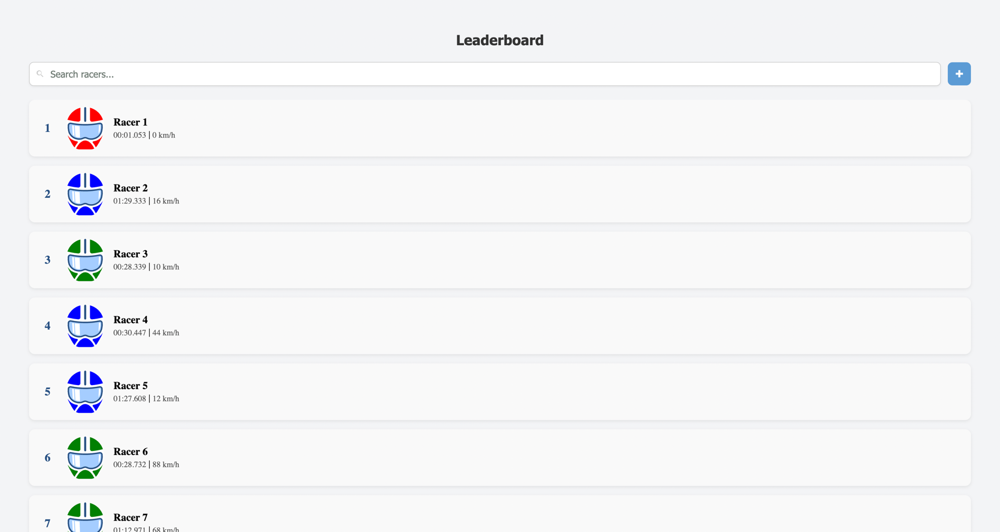

# 🏎️ RacersList

**RacersList** is a web application built with Angular that allows users to view and manage a list of racers. The
project leverages the Angular CLI for development and is deployed on Vercel for easy access.

🔗 **Live Demo**: [racers-list.vercel.app](https://racers-list.vercel.app) (admin/admin)

---

## ✨ Features

- 🛠️ Built with Angular CLI version 19.2.11
- 🎨 Responsive and user-friendly interface
- 🚀 Deployed on Vercel for seamless access
- 📁 Organized project structure for scalability

---

## 🛠️ Getting Started

### 📋 Prerequisites

- 🟢 Node.js (v14 or higher)
- 📦 npm package manager
- 🅰️ Angular

### 📥 📁 Project Structure

```yaml
racersList/
├── src/                 📁 Source files
│   ├── app/             📁 Application components and modules
│   ├── assets/          📁 Static assets
│   └── environments/    📁 Environment configurations
├── angular.json         🛠️ Angular CLI configuration
├── package.json         📦 Project metadata and scripts
├── tsconfig.json        🧪 TypeScript configuration
└── README.md            📄 Project documentation
```

### 📸 Preview


